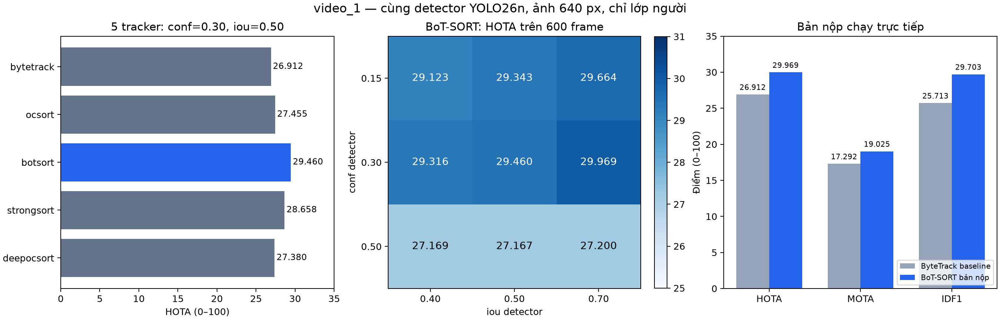
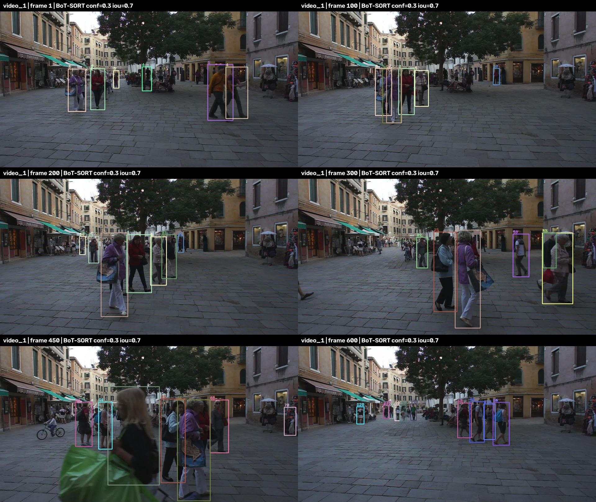
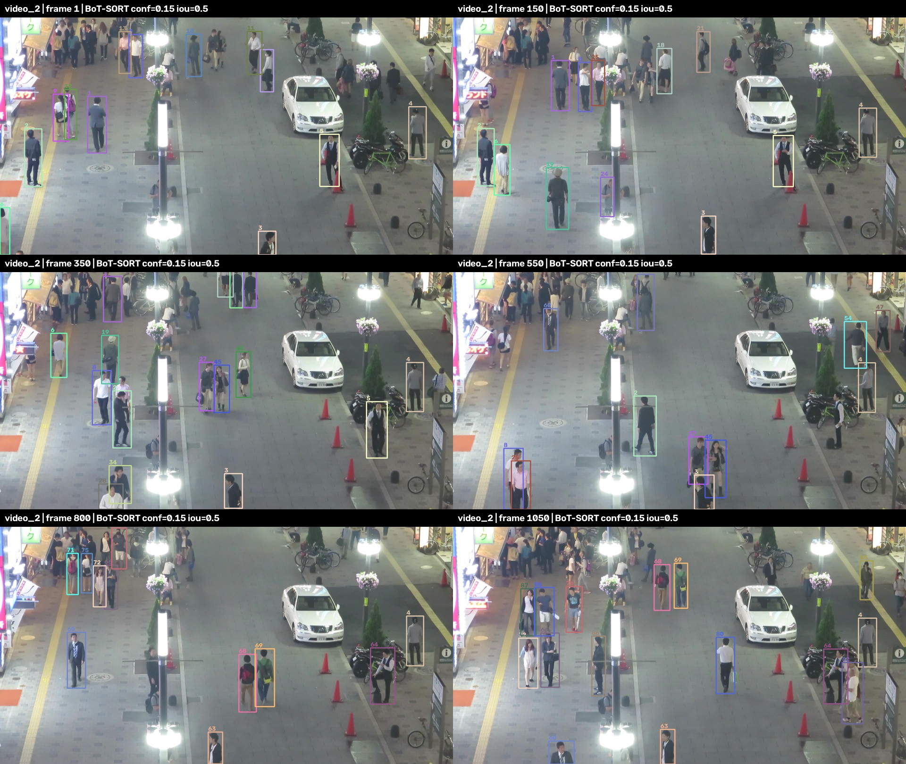
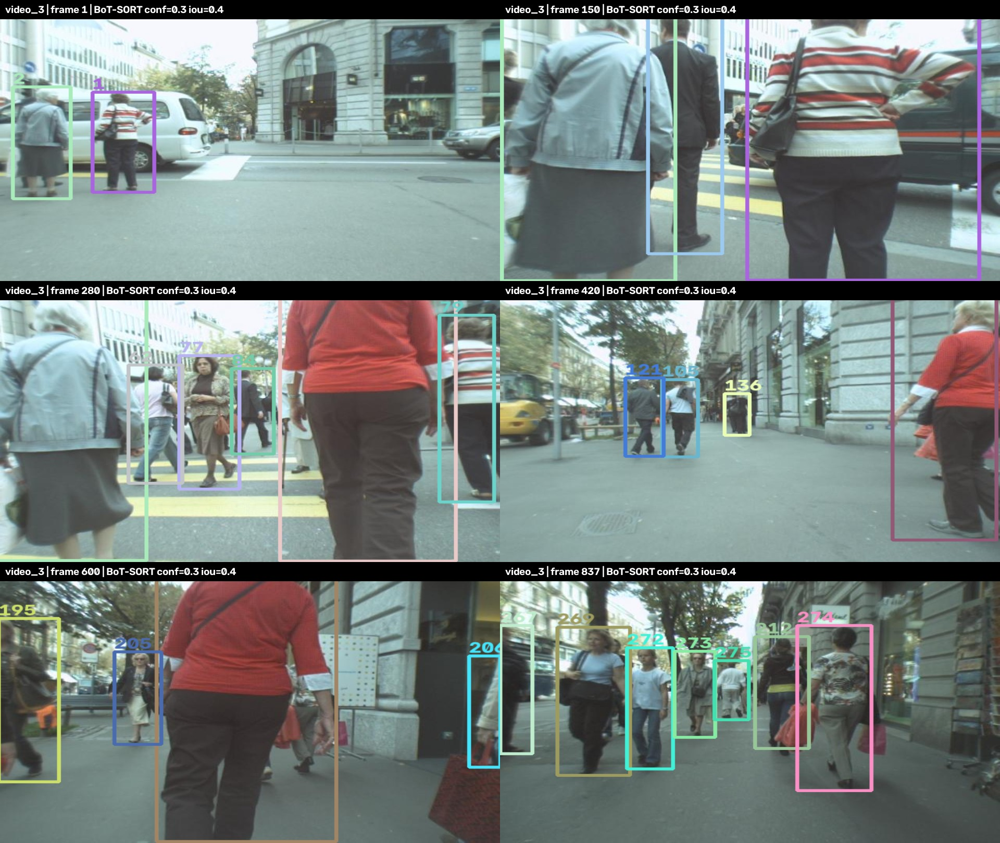
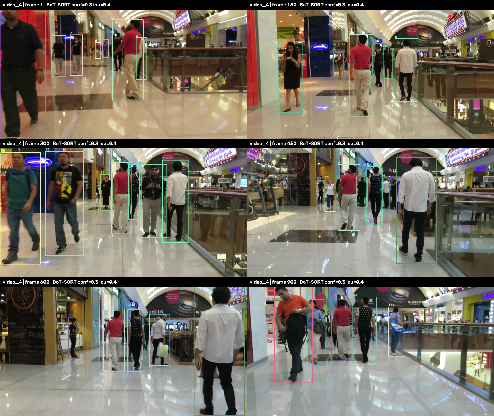
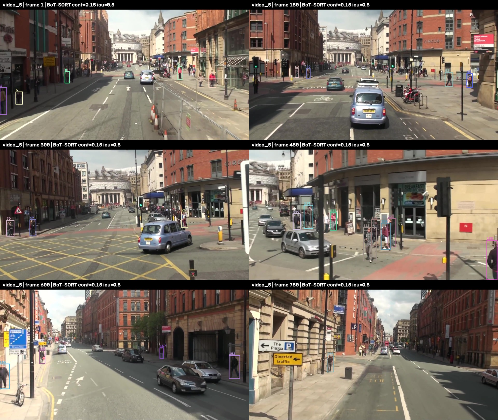

# Báo cáo lab: lựa chọn tracker cho 5 video

**Họ tên:** Nguyễn Văn Thân
**Mã sinh viên:** 2A202602859
**Hình thức:** Cá nhân
**Ngày thực hiện:** 09/10/2026

## 1. Mục tiêu và điều kiện cố định

So sánh khả năng theo dõi người và giữ danh tính trong năm cảnh khác nhau. Giữ nguyên `yolo26n.pt`, kích thước đầu vào **640 px**, lớp người **0** và Re-ID `osnet_x0_25_msmt17.pt`. Không huấn luyện lại hoặc thay trọng số; không sửa ngưỡng nội bộ của tracker. Chỉ chọn tracker và hai ngưỡng của detector: `conf`, `iou` của NMS.

Chỉ `video_1` có ground truth. Không tìm hoặc tạo nhãn cho `video_2`–`video_5`, không điền HOTA/MOTA/IDF1 cho bốn video này. [Dấu vân tay dữ liệu và số frame](../evidence/data_manifest.json) xác nhận 600 / 1.050 / 837 / 900 / 750 ảnh, tổng **4.137 frame**.

## 2. CP1 và CP2

Đã kiểm tra dữ liệu, quan sát các cảnh và viết [giả thuyết trước thử nghiệm](../evidence/CP1.md). Gói dữ liệu tại máy không chứa video preview gốc; quan sát chuỗi ảnh, rồi xuất video có ID từ các lượt chạy để kiểm tra kết quả. [Notebook đã thực thi](../on_tap_metrics.ipynb) trả lời **True / False / True**, cả ba câu đúng; chạy YOLO trên một frame và so sánh confidence. Hộp detector có confidence nhưng chưa có track ID.

Baseline CP2 dùng ByteTrack, `conf=0.3`, `iou=0.5`, **150 frame đầu** của `video_1`. Trong [ảnh baseline](../evidence/baseline_video_1.jpg), người mặc áo đỏ giữ ID 2 ở các frame 1/30/60/90/120/150, nhưng quanh người áo tím xuất hiện hộp chồng nhau ở frame 90. Nhiều người nhỏ phía xa chưa có hộp. Đây là quan sát tại các frame được đánh dấu; không suy ra rằng mọi frame giữa hai ảnh đều giữ đúng ID. File baseline 150 frame không dùng làm bài nộp.

## 3. Thiết kế thử nghiệm

Thực hiện **53 lượt thử**, có file MOT, metadata và checksum trong [experiments/](experiments/); [EXPERIMENTS.csv](EXPERIMENTS.csv) tổng hợp cấu hình và kết quả.

- Với mỗi video thử đủ **5 tracker** tại `conf=0.3`, `iou=0.5`: ByteTrack, OC-SORT, BoT-SORT, StrongSORT và DeepOCSORT. Video_1 chạy đủ 600 frame; bốn video còn lại dùng 150 frame đầu để sàng lọc nhanh.
- Video_1 so sánh thêm cả 5 tracker tại `conf=0.15`, `iou=0.5`, rồi thử đủ 9 cặp `conf={0.15,0.3,0.5}` × `iou={0.4,0.5,0.7}` với BoT-SORT. Tổng cộng **17 cấu hình video_1**, đều chạy đủ 600 frame.
- Với mỗi video_2–video_5, BoT-SORT được thử tại baseline `(0.3,0.5)`, rồi lần lượt `(0.15,0.5)`, `(0.5,0.5)`, `(0.3,0.4)`, `(0.3,0.7)`. Mỗi phép đối chiếu với baseline chỉ thay **một** tham số.
- Sau sàng lọc, chạy ByteTrack baseline đủ frame cho cả năm video để có đối chiếu toàn cảnh. Năm cấu hình nộp được chạy lại **trực tiếp trên toàn bộ ảnh**, không có `--max-frames`, và được kiểm tra ở các đoạn đầu/giữa/cuối.

ByteTrack và OC-SORT chủ yếu dùng chuyển động. Ba tracker còn lại bổ sung ngoại hình. BoT-SORT có bù chuyển động camera trong cấu hình mặc định đang dùng. Việc cùng chọn BoT-SORT cho cả năm video là kết quả sàng lọc từng cảnh; không có yêu cầu phải chọn năm thuật toán khác nhau. Ngưỡng detector được chọn riêng theo cảnh. Với video không có nhãn, đây là lựa chọn thực nghiệm dựa trên quan sát, không phải chứng minh tracker đứng đầu tuyệt đối.

### Tối ưu thời gian mà giữ đúng đề

Tận dụng GTX 1650 4 GB và môi trường CUDA sẵn có. Cache detector lưu riêng đầu ra tại IoU 0.4/0.5/0.7, confidence 0.15; lọc confidence cao hơn để thử tracker. Đã đối chiếu với suy luận trực tiếp trên **12 frame trải đều mỗi video × 6 cấu hình**, tổng **360 kiểm tra**; tất cả đạt kiểm tra số học trong [các manifest detector](../evidence/).

Kiểm tra thêm baseline trực tiếp và cache trên 150 frame: cùng số dòng và cùng `(frame, ID)`, sai khác tọa độ sau làm tròn tối đa **0.01 px**, confidence tối đa **0.0001**. Hai file không giống từng byte; [biên bản kiểm tra](../evidence/cache_tracking_equivalence.json) lưu rõ sai số. **Cả năm file nộp cuối đều dùng suy luận trực tiếp**, nên cache không tham gia tạo bản nộp.

Thời gian trong CSV thử nghiệm gồm đọc ảnh và tracker, chưa gồm detector đã cache hoặc mã hóa video; không so trực tiếp với FPS end-to-end. Các lượt chạy có thể dùng GPU đồng thời, nên thời gian này không phải benchmark tốc độ được kiểm soát.

## 4. Cấu hình được nộp

| Video | Tracker | conf | iou | Quan sát và lý do | Cấu hình đã thử nhưng loại |
|---|---|---:|---:|---|---|
| video_1 | BoT-SORT | 0.30 | 0.70 | HOTA cao nhất trong 17 cấu hình đã thử; tăng khả năng bao phủ và liên kết, nhưng vẫn có hộp trùng và bỏ sót người xa | ByteTrack 0.30/0.50: HOTA thấp hơn; BoT-SORT 0.50/0.50: bỏ sót tăng |
| video_2 | BoT-SORT | 0.15 | 0.50 | Ngưỡng thấp giữ thêm hộp yếu trong cảnh đêm; người đứng bên phải giữ ID 4 tại các frame chụp xuyên suốt chuỗi | BoT-SORT 0.50/0.50: nhiều người rõ ở phần trên/giữa không còn hộp; ByteTrack 0.30/0.50 có ít hộp hơn trong các đoạn đối chiếu |
| video_3 | BoT-SORT | 0.30 | 0.40 | Giữ hai người tiền cảnh ở đoạn đầu; chọn conf vừa phải và NMS chặt hơn để hạn chế hộp chồng khi camera đi vào đám đông | BoT-SORT 0.30/0.70: nhiều hộp hơn, xuất hiện hộp chồng ở đoạn đầu; StrongSORT 0.30/0.50 có thời gian xác nhận nên chưa xuất hộp cho hai người tiền cảnh ở frame đầu |
| video_4 | BoT-SORT | 0.30 | 0.40 | Người áo đỏ giữ ID 2 tại các frame 1/150/300/450/600; vẫn thấy đổi ID ở người áo trắng sau che khuất | BoT-SORT 0.15/0.50: nhiều hộp yếu hơn cần kiểm tra trong cảnh phản chiếu; ByteTrack 0.30/0.50 cũng đổi ID người áo trắng sau che khuất |
| video_5 | BoT-SORT | 0.15 | 0.50 | Giữ thêm hộp người nhỏ bên đường; dùng bù camera và ngoại hình khi góc nhìn thay đổi | BoT-SORT 0.50/0.50: giảm rõ hộp người trong thử 150 frame; ByteTrack 0.30/0.50 bỏ nhiều người xa |

## 5. Số liệu video_1

TrackEval chấm đủ **600 frame**, giữ tiền xử lý mặc định cho lớp người. Gói ảnh thiếu `eval_config.json`; script dùng cấu hình dự phòng **LAB21/train**, không sửa nhãn hoặc đặt lại lớp GT. Nhãn được sao chép nguyên nội dung để chấm. [Log chấm đầy đủ](../evidence/video_1_evaluation.log), [summary gốc](../evidence/video_1_metrics.txt), [bảng chi tiết](../evidence/video_1_metrics_detailed.csv).

Các metric dưới đây dùng thang **0–100**.

| Cấu hình | HOTA | MOTA | IDF1 | IDSW | FN | FP |
|---|---:|---:|---:|---:|---:|---:|
| ByteTrack 0.30/0.50 — baseline | 26.912 | 17.292 | 25.713 | 12 | 15.249 | 107 |
| OC-SORT 0.30/0.50 | 27.455 | 19.811 | 28.733 | 42 | 14.605 | 253 |
| BoT-SORT 0.30/0.50 | 29.460 | 19.811 | 29.354 | 25 | 14.538 | 337 |
| StrongSORT 0.30/0.50 | 28.658 | 19.698 | 29.854 | 41 | 14.649 | 231 |
| DeepOCSORT 0.30/0.50 | 27.380 | 19.762 | 27.798 | 51 | 14.610 | 248 |
| StrongSORT 0.15/0.50 | 29.190 | 19.907 | **32.573** | 110 | 13.340 | 1.432 |
| BoT-SORT 0.15/0.50 | 29.343 | **20.731** | 29.561 | 27 | 14.197 | 505 |
| **BoT-SORT 0.30/0.70 — bản nộp trực tiếp** | **29.969** | **19.025** | **29.703** | **33** | **14.402** | **611** |

Chọn cấu hình có **HOTA cao nhất trong phạm vi đã thử**, vì đề xem HOTA là số tổng cân bằng phát hiện và liên kết. So với baseline, HOTA tăng **3.057 điểm**, MOTA tăng **1.733 điểm**, IDF1 tăng **3.990 điểm**. Đây không phải cấu hình cao nhất ở mọi metric: StrongSORT confidence 0.15 có IDF1 cao hơn, còn BoT-SORT confidence 0.15/IoU 0.5 có MOTA cao hơn.

FN giảm từ 15.249 xuống 14.402 nhưng FP tăng từ 107 lên 611, IDSW tăng từ 12 lên 33. Baseline theo dõi ít người hơn, nên chỉ nhìn số IDSW thấp sẽ bỏ qua lỗi bỏ sót. DetA tăng từ 15.068 lên 18.408, AssA từ 48.130 lên 49.061. Kết quả vẫn bị giới hạn bởi nhiều người nhỏ và che khuất; không mô tả bản nộp là giữ ID hoàn hảo.

Đầu ra tổng hợp rút từ summary TrackEval:

```text
video_1 — BoT-SORT conf=0.30 iou=0.70
HOTA     MOTA     IDF1     IDSW     FN       FP
29.969   19.025   29.703   33       14402    611
```



## 6. Phân tích theo cảnh và bằng chứng

### video_1 — camera tĩnh, quảng trường ban ngày

Ở frame 1/100, BoT-SORT giữ người áo đỏ ID 2 và người áo tím ID 3, nhưng tại frame 100 còn một hộp khác chồng lên người áo tím. Khi nhiều người cắt ngang ở frame 300/450, xuất hiện thêm ID và hộp chồng; Re-ID không giải quyết hết che khuất. So sánh định lượng cho thấy BoT-SORT cải thiện HOTA so với ByteTrack trên toàn chuỗi, dù không giảm được mọi loại lỗi. IoU 0.7 giữ nhiều hộp hơn; đổi lại recall và HOTA tăng trong khi FP cũng tăng, nên chọn dựa trên metric thay vì chỉ nhìn ảnh có nhiều hộp.



### video_2 — phố đêm, camera trên cao

Trong thử 150 frame, confidence 0.5 làm mất hộp ở nhiều người đứng quanh vùng trên và giữa ảnh; confidence 0.15 giữ lại một số hộp yếu khi ánh sáng và kích thước người thay đổi. Trên bản cuối, người đứng bên phải gần xe máy giữ ID 4 tại các ảnh frame 1/150/350/550/800/1050. Ngoại hình có thể hỗ trợ liên kết khi người giao nhau, nhưng ảnh vẫn có người ở xa chưa được theo dõi và hộp gần nhau trong vùng đông. Thử IoU 0.4 và 0.5 tại confidence 0.3 cho kết quả MOT giống nhau trên 150 frame đầu; không khẳng định IoU 0.4 tốt hơn từ phép thử đó, nên giữ 0.5.



[Đối chiếu confidence 0.5 bị loại](../evidence/video_2_conf050_rejected.jpg) · [ByteTrack toàn cảnh](../evidence/video_2_baseline.jpg)

### video_3 — camera di động, ảnh nhỏ và che khuất gần

Hai người tiền cảnh giữ ID 1 và 2 tại frame 1 và 150; ở frame 280, người ở gần che phần lớn ảnh và các hộp phía xa trở nên khó phân biệt. Chọn BoT-SORT để bổ sung ngoại hình và bù camera thay vì chỉ dựa vào dự đoán chuyển động ảnh. IoU 0.7 tạo 881 dòng trong thử 150 frame, so với 764 dòng ở IoU 0.4; ảnh đối chiếu cho thấy hộp chồng, nên chọn 0.4 để hạn chế chúng. Số dòng không phải metric chất lượng; các frame 420/600/837 vẫn cho thấy giới hạn với người nhỏ, che khuất và nhiều danh tính mới.



[IoU 0.7 bị loại](../evidence/video_3_iou070_rejected.jpg) · [ByteTrack toàn cảnh](../evidence/video_3_baseline.jpg)

### video_4 — camera đi trong nhà, phản chiếu

Người áo đỏ phía trước giữ ID 2 tại các frame 1/150/300/450/600 dù có người đi ngược chiều. Tuy nhiên, người áo trắng có ID 6 tại frame 150/300 rồi ID 48 tại frame 450/600: cấu hình vẫn mất danh tính qua che khuất, tương tự vấn đề thấy ở baseline. BoT-SORT được chọn vì kết hợp bù camera với ngoại hình, đồng thời theo dõi người áo trắng đã lộ một phần ngay frame đầu. Confidence 0.3 giữ mức sàng lọc vừa phải; IoU 0.4 hạn chế hộp trùng nhưng vẫn có thể bỏ một người khi hai người chồng nhiều. Không khẳng định mọi hộp trên vùng kính/sàn đều là người thật hoặc mọi phản chiếu đều đã bị loại.



[ByteTrack toàn cảnh](../evidence/video_4_baseline.jpg)

### video_5 — camera trên xe và chuyển hướng tại giao lộ

Người nhỏ trong vùng tối bên trái được giữ thêm hộp ở cấu hình confidence 0.15, trong khi confidence 0.5 giảm mạnh số hộp trong thử nhanh. Ở frame 300/450, camera tiến và đổi góc nhìn, người cạnh cột đèn dễ bị che hoặc ra khỏi ảnh; vì vậy bù camera và ngoại hình là lý do chọn BoT-SORT. Frame 600/750 vẫn có nhiều người rất xa không có ID; hạ confidence không giải quyết được toàn bộ giới hạn detector ở đầu vào 640 px. Không coi các ID mới sau khi camera rẽ là lỗi đổi ID nếu chưa xác định đó là cùng một người; không có GT để chấm kết luận này.



[ByteTrack toàn cảnh](../evidence/video_5_baseline.jpg)

## 7. Kiểm tra và khả năng chạy lại

Năm file [results/](results/) là bản sao của `runs/nop_bai/` tại máy và đã đối chiếu SHA-256. Mỗi file có 10 cột MOT, frame/ID nguyên hợp lệ, không trùng `(frame, ID)`, hộp có chiều rộng/cao dương, confidence trong [0,1], không có NaN/vô cực. Metadata ghi số frame thật đã xử lý; không yêu cầu mỗi frame phải có một dòng vì có thể không phát hiện người. [Biên bản kiểm tra](../evidence/validation.json).

Đã chạy **19 kiểm thử** trên môi trường Conda Python 3.11. Notebook cũng chạy trong kernel `cv_robotics_lab21`. Lần chạy chính dùng Python 3.13, PyTorch 2.10.0 CUDA 12.6, Ultralytics 8.4.171, BoxMOT 10.0.42, NumPy 2.2.6, GPU GTX 1650. [Phiên bản và hash trọng số](../evidence/runtime.json). Không đổi thuật toán tracker; thay đổi code chỉ phục vụ thiết bị, tương thích thư viện, cache thử nghiệm, xuất bằng chứng và kiểm tra dữ liệu.

```powershell
conda activate cv_robotics_lab21
python -m pytest -q
powershell -ExecutionPolicy Bypass -File scripts/reproduce.ps1 -Device cpu -TrackEvalRoot ..\TrackEval
```

Nếu có PyTorch CUDA tương thích, dùng `-Device cuda:0`. Video xem kết quả được lưu tại máy trong `runs/nop_bai/`, không commit dữ liệu ảnh, video preview hoặc trọng số lên GitHub. Các ảnh tĩnh trong báo cáo là bằng chứng đã vẽ ID từ file MOT thật.

## 8. Nếu có thêm thời gian

Kiểm tra các đoạn lỗi cụ thể quanh che khuất và camera rẽ, rồi thử confidence mịn hơn quanh cấu hình đã chọn. Nếu được phép làm phần mở rộng ngoài luật bài chính, mới thử Re-ID hoặc detector khác; các thành phần đó giữ nguyên trong toàn bộ bài nộp này.
